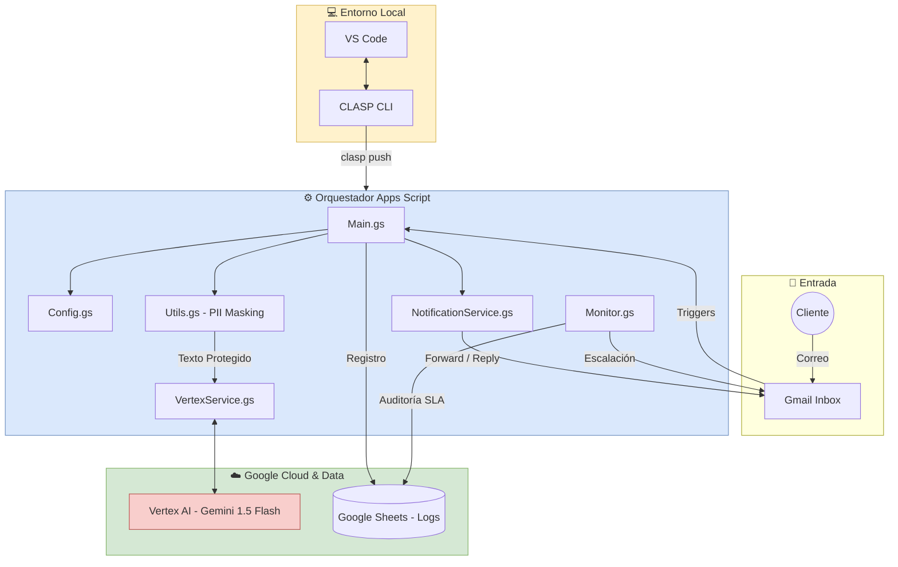

<p align="center">
    <b>Select Language:</b><br>
    <a href="README.md">🇺🇸 English</a> |
    <a href="README.sp.md">🇪🇸 Español</a>
</p>

---

# 🚀 Smart Complaint Orchestrator: Google Workspace + Vertex AI

## 🎯 Project Objective
This project aims to transform customer service management from a manual, reactive process into an **intelligent, automated, and scalable operation**. The system orchestrates the Google Workspace ecosystem (Gmail + Sheets) with the power of **Vertex AI (Gemini 1.5 Flash)** to classify, route, and audit complaints in real-time.

## 💡 Solution & Optimization
Unlike traditional keyword-based systems, this orchestrator utilizes **Semantic Intelligence**. It understands the actual context of a problem (Logistics, Quality, etc.), even if the customer uses informal or complex language, ensuring high accuracy in triage.

### Key Business Value:
* **Reduced Response Time:** Automated triage and immediate forwarding to the responsible department.
* **Cost Efficiency:** Processes high volumes of data with marginal serverless operating costs.
* **Intelligent Audit:** SLA tracking via a monitor that escalates unresolved cases after 24 hours.
* **Privacy by Design:** Automated anonymization layer to protect sensitive data (PII).

---

## 🏗️ System Architecture
The project follows a modular design to ensure maintainability and separation of concerns:

* **`Main.gs`**: Central orchestrator of the workflow.
* **`Config.gs`**: Centralized management of constants and environment variables.
* **`VertexService.gs`**: Integration layer with the Vertex AI API.
* **`NotificationService.gs`**: Communications engine (forwards and replies).
* **`Monitor.gs`**: Vigilance system for SLA compliance.
* **`Utils.gs`**: Security utilities and text processing (PII Protection).




---

## 🛠️ Tech Stack
* **Google Apps Script**: Serverless execution environment.
* **Vertex AI (Gemini 1.5 Flash)**: LLM-powered text classification.
* **Gmail API**: Mail thread interception and management.
* **Google Sheets API**: Database for traceability and auditing.
* **CLASP**: Local development and version control via CLI.

---

## 🔒 Privacy & Data Security (PII Protection)
To ensure compliance with data protection regulations, the system includes an **automatic anonymization layer**. Before sending any information to the AI, the engine scrubs:
* Email addresses.
* Phone numbers / ID strings.
* Excess whitespace for token optimization.

---

## ⚙️ Setup & Deployment

### 1. Google Cloud Platform (GCP) Configuration
The script must be linked to a GCP project with the **Vertex AI API** enabled.
* **Link Project:** Go to Project Settings (⚙️) in the Apps Script editor. Under "Google Cloud Platform (GCP) Project", click "Change project" and enter your **Project Number**.

### 2. Environment Variables (Script Properties)
To avoid hardcoding sensitive data, configure the following keys in **Project Settings > Script Properties**:

| Property | Description |
| :--- | :--- |
| `PROJECT_ID` | Your GCP Project ID. |
| `SPREADSHEET_ID` | The ID of the Google Sheet for logging. |
| `EMAIL_LOGISTICA` | Email address for the Logistics department. |
| `EMAIL_CALIDAD` | Email address for the Quality department. |
| `EMAIL_SUPERVISOR` | Supervisor email for CC and alerts. |

### 3. Project Manifest (`appsscript.json`)
The manifest must include the following OAuth scopes for proper execution:

```json
{
  "timeZone": "America/Lima",
  "exceptionLogging": "STACKDRIVER",
  "runtimeVersion": "V8",
  "oauthScopes": [
    "[https://www.googleapis.com/auth/script.external_request](https://www.googleapis.com/auth/script.external_request)",
    "[https://www.googleapis.com/auth/spreadsheets](https://www.googleapis.com/auth/spreadsheets)",
    "[https://www.googleapis.com/auth/gmail.modify](https://www.googleapis.com/auth/gmail.modify)",
    "[https://www.googleapis.com/auth/cloud-platform](https://www.googleapis.com/auth/cloud-platform)",
    "[https://www.googleapis.com/auth/script.send_mail](https://www.googleapis.com/auth/script.send_mail)"
  ]
}
```

## 🚀 Automation (Triggers)
For 24/7 autonomous operation, it is recommended to configure the following time-driven triggers in the Apps Script editor:
1.  **`processIncomingEmails`**: Time-driven -> Minutes timer -> Every 10 to 15 minutes.
2.  **`monitorSlaDeadlines`**: Time-driven -> Hour timer -> Every 1 hour.

---

## 💻 Managing or Working from VS Code
This project is designed for local development using **CLASP (Command Line Apps Script Projects)**. This allows you to use **VS Code**, manage versions with Git, and maintain a professional development cycle.

### 1. Tool Installation
First, ensure you have [Node.js](https://nodejs.org/) installed on your machine, then run:

```bash
npm install -g @google/clasp
```

### 2. Essential Commands
Una vez instalado, utiliza estos comandos para gestionar tu flujo de trabajo profesional desde la terminal:
* **Login:** Link your Google account with the local environment.
  ```bash
  clasp login
  ```

* **Push (Local → Cloud):** Upload your VS Code changes to Apps Script.
  ```bash
  clasp push
  ```

* **Pull (Cloud → Local):** Fetch changes made in the web editor (if any).
  ```bash
  clasp pull
  ```

* **Real-Time Monitoring:** View logs and AI responses without leaving the terminal.
  ```bash
  clasp logs --watch
  ```


