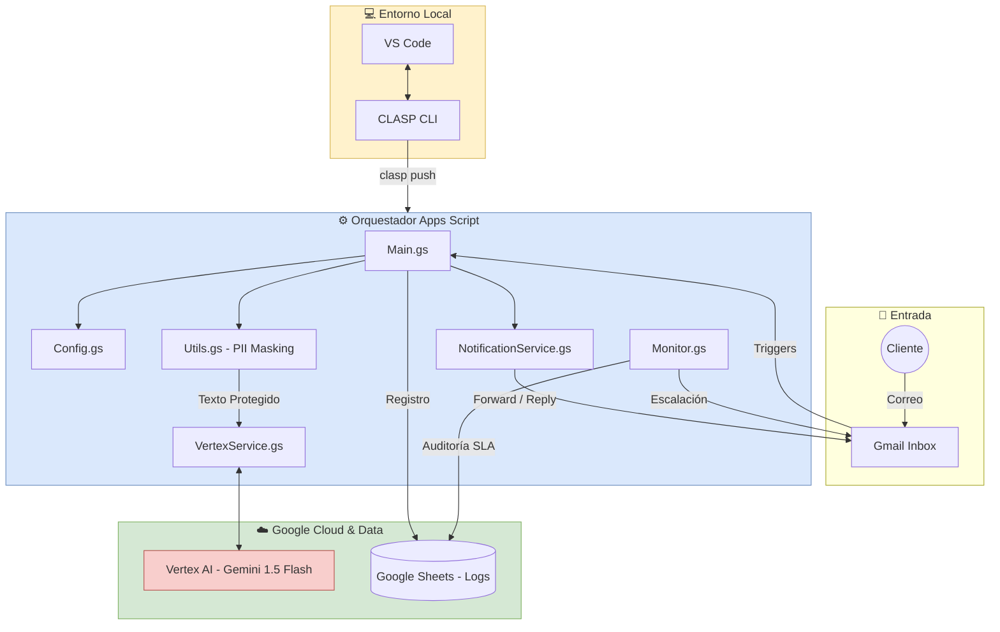

<p align="center">
    <b>Select Language:</b><br>
    <a href="README.md">🇺🇸 English</a> |
    <a href="README.sp.md">🇪🇸 Español</a>
</p>

---

# 🚀 Orquestador Inteligente de Reclamos: Google Workspace + Vertex AI

## 🎯 Objetivo del Proyecto|
Este proyecto busca transformar la gestión de atención al cliente de un proceso manual y reactivo a una **operación inteligente, automatizada y escalable**. El sistema orquestra el ecosistema de Google Workspace (Gmail + Sheets) con la potencia de la IA Generativa de **Vertex AI (Gemini 2.5 Flash)** para clasificar, derivar y auditar reclamos en tiempo real.

## 💡 Solución y Optimización
A diferencia de los sistemas tradicionales basados en "palabras clave", este orquestador utiliza **Inteligencia Semántica**. Entiende el contexto real de un problema (Logística, Calidad, etc.), incluso si el cliente utiliza un lenguaje informal o complejo, garantizando una alta precisión en el triaje.

### Valor Estratégico para el Negocio:
* **Reducción del Tiempo de Respuesta:** Triaje automatizado y derivación inmediata al área responsable.
* **Eficiencia de Costos:** Procesamiento de grandes volúmenes de datos con costos operativos marginales (arquitectura serverless).
* **Auditoría Inteligente:** Seguimiento de SLA mediante un monitor que escala casos pendientes tras 24 horas.
* **Privacidad desde el Diseño:** Capa de anonimización automática para proteger datos sensibles (PII).

---

## 🏗️ Arquitectura del Sistema
El proyecto sigue un diseño modular para garantizar la mantenibilidad y la separación de responsabilidades:

* **`Main.gs`**: Orquestador central del flujo de trabajo y lógica de negocio.
* **`Config.gs`**: Gestión centralizada de constantes y variables de entorno (Script Properties).
* **`VertexService.gs`**: Capa de integración técnica con la API de Vertex AI.
* **`NotificationService.gs`**: Motor de comunicaciones encargado de reenvíos y respuestas automáticas.
* **`Monitor.gs`**: Sistema de vigilancia activa para el cumplimiento de plazos (SLA).
* **`Utils.gs`**: Utilidades de seguridad y procesamiento de texto (Protección de datos PII).



---

## 🛠️ Stack Tecnológico
* **Google Apps Script**: Entorno de ejecución serverless en la nube de Google.
* **Vertex AI (Gemini 2.5 Flash)**: Clasificación de texto mediante Modelos de Lenguaje de Gran Escala (LLM).
* **Gmail API**: Intercepción, lectura y gestión avanzada de hilos de correo.
* **Google Sheets API**: Base de datos ligera para trazabilidad, registro y auditoría.
* **CLASP**: Herramienta de línea de comandos para desarrollo local y control de versiones.

---

## 🔒 Privacidad y Seguridad (Protección PII)
Para garantizar el cumplimiento de las normativas de protección de datos personales, el sistema incluye una **capa de anonimización automática**. Antes de que cualquier información sea procesada por la IA fuera del entorno local, el motor limpia:
* Direcciones de correo electrónico.
* Números de identificación, DNI y teléfonos.
* Excesos de espacios en blanco para optimizar el consumo de tokens.

---

## ⚙️ Configuración y Despliegue

### 1. Configuración de Google Cloud Platform (GCP)
El script de Google Apps Script debe estar vinculado a un proyecto de GCP con la **API de Vertex AI** habilitada.
* **Vincular Proyecto:** En el editor de Apps Script, ve a **Configuración del proyecto (⚙️)**. En la sección "Proyecto de Google Cloud Platform (GCP)", haz clic en "Cambiar proyecto" e ingresa tu **Número de Proyecto**.

### 2. Variables de Entorno (Script Properties)
Para evitar la exposición de datos sensibles en el código fuente, se deben configurar las siguientes claves en **Configuración del proyecto > Propiedades de la secuencia de comandos**:

| Propiedad | Descripción |
| :--- | :--- |
| `PROJECT_ID` | ID único de tu proyecto en Google Cloud Console. |
| `SPREADSHEET_ID` | ID de la hoja de cálculo de Google donde se registran los casos. |
| `EMAIL_LOGISTICA` | Correo electrónico destinado al área de Logística. |
| `EMAIL_CALIDAD` | Correo electrónico destinado al área de Calidad. |
| `EMAIL_SUPERVISOR` | Correo del supervisor para auditoría (CC) y alertas de SLA. |

### 3. Manifiesto del Proyecto (`appsscript.json`)
Es indispensable que el manifiesto incluya los alcances (scopes) de OAuth necesarios para que el bot pueda operar:

```json
{
  "timeZone": "America/Lima",
  "exceptionLogging": "STACKDRIVER",
  "runtimeVersion": "V8",
  "oauthScopes": [
    "https://www.googleapis.com/auth/script.external_request",
    "https://www.googleapis.com/auth/spreadsheets",
    "https://www.googleapis.com/auth/gmail.modify",
    "https://www.googleapis.com/auth/cloud-platform",
    "https://www.googleapis.com/auth/userinfo.email"
  ]
}
```

## 🚀 Automatización (Triggers)
Para que el sistema opere de forma autónoma las 24 horas del día, se deben configurar los siguientes activadores basados en tiempo directamente en el panel de **Activadores** de Google Apps Script:

1.  **`processIncomingEmails`**: 
    * Seleccionar fuente del evento: **Según tiempo**.
    * Tipo de activador: **Temporizador de minutos**.
    * Intervalo: **Cada 10 o 15 minutos**.
2.  **`monitorSlaDeadlines`**: 
    * Seleccionar fuente del evento: **Según tiempo**.
    * Tipo de activador: **Temporizador de horas**.
    * Intervalo: **Cada 1 hora**.

---

## 💻 Gestionar o Trabajar desde VS Code
Este proyecto está diseñado para desarrollarse localmente utilizando **CLASP (Command Line Apps Script Projects)**. Esto permite usar **VS Code**, gestionar versiones con Git y evitar el editor web.

### 1. Instalación de Herramientas
Primero, asegúrate de tener [Node.js](https://nodejs.org/) instalado y ejecuta:
```bash
npm install -g @google/clasp
```

### 2. Comandos Esenciales
Una vez instalado, utiliza estos comandos para gestionar tu flujo de trabajo profesional desde la terminal:

* **Iniciar Sesión:** Vincula tu cuenta de Google con el entorno local.
  ```bash
  clasp login
    ```

* **Sincronizar(Local -> Nube):** sube tus cambios de VS Code a Apps Script.
  ```bash
  clasp push
    ```

* **Descargar(Nube -> Local):** Trae cambios hechos en el editor web(si los hay)
  ```bash
  clasp pull
    ```

* **Monitoreo en Tiempo Real:** Visualiza los logs y respuesta de la IA sin salir de la terminal
  ```bash
  clasp logs --watch
    ```
### 3. Extenciones
**Google Apps Script IntelliSense**: [Instalar extensión](https://marketplace.visualstudio.com/items?itemName=apenara.gas-intellisense)


